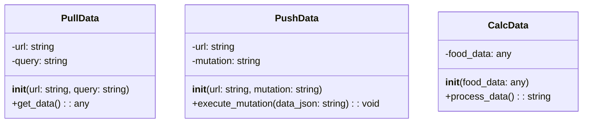

Let's go!

```mermaid
classDiagram

    class PullData {
    -url: string
    -query: string
    __init__(url: string, query: string)
    +get_data(): any
}

    class PushData {
    -url: string
    -mutation: string
    __init__(url: string, mutation: string)
    +execute_mutation(data_json: string): void
}

    class CalcData {
    -food_data: any
    __init__(food_data: any)
    +process_data(): string
}

```

