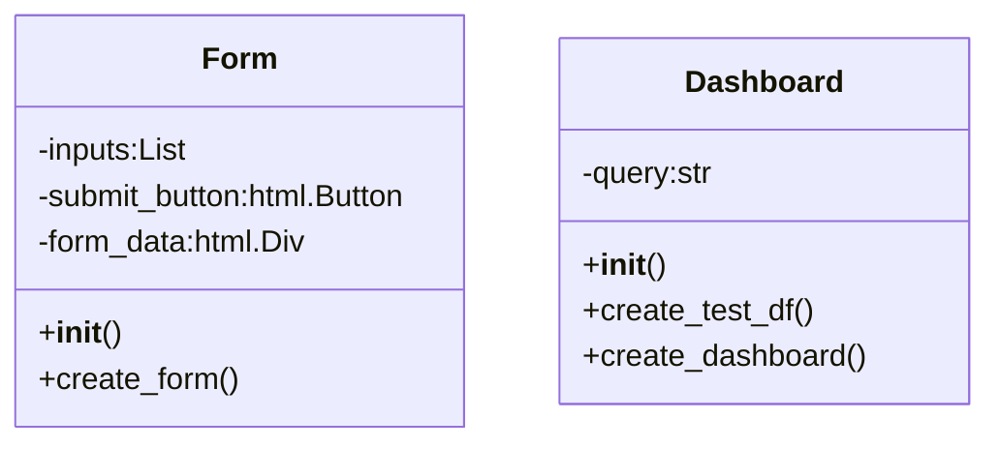

Let's go!

```mermaid

classDiagram
    class Form {
        +__init__()
        +create_form()
        -inputs:List
        -submit_button:html.Button
        -form_data:html.Div
    }

    class Dashboard {
        +__init__()
        +create_test_df()
        +create_dashboard()
        -query:str
    }

```