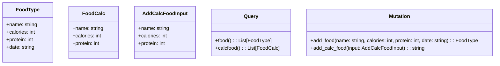

Let's go!

```mermaid
classDiagram

    class FoodType {
        +name: string
        +calories: int
        +protein: int
        +date: string
    }
    class FoodCalc {
        +name: string
        +calories: int
        +protein: int
    }
    class AddCalcFoodInput {
        +name: string
        +calories: int
        +protein: int
    }

    class Query {
    +food(): List[FoodType]
    +calcfood(): List[FoodCalc]
}
    class Mutation {
        +add_food(name: string, calories: int, protein: int, date: string): FoodType
        +add_calc_food(input: AddCalcFoodInput): string
    }
```