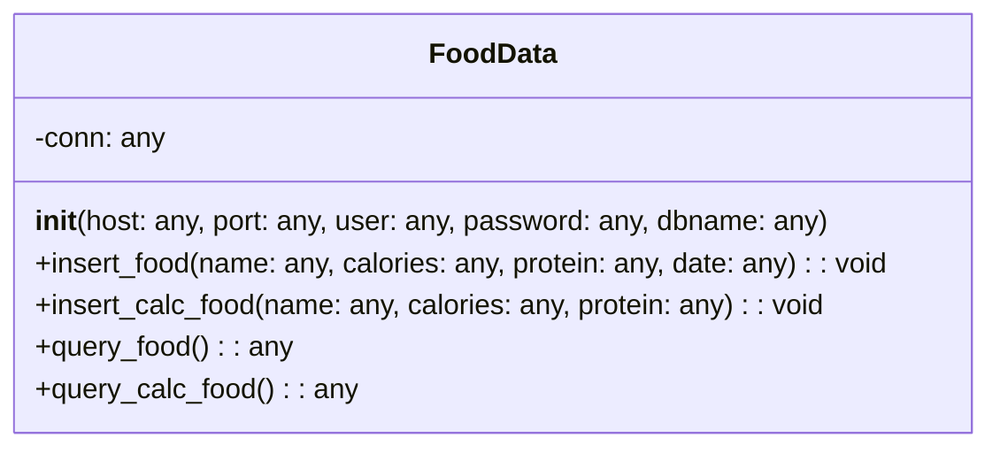

Let's go!

```mermaid
classDiagram

class FoodData {
    -conn: any
    __init__(host: any, port: any, user: any, password: any, dbname: any)
    +insert_food(name: any, calories: any, protein: any, date: any): void
    +insert_calc_food(name: any, calories: any, protein: any): void
    +query_food(): any
    +query_calc_food(): any
}
```